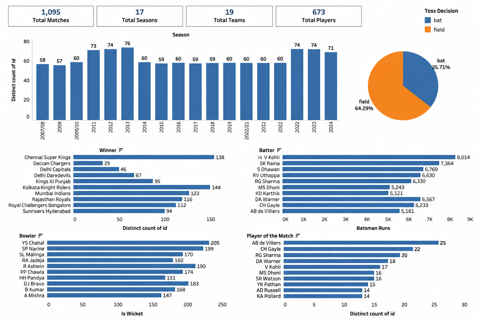

# 🏏 IPL Data Analysis (2008–2024)

This project is based on IPL data from 2008 to 2024. I built this project to practice Python, SQL, and Tableau by working on a real-world dataset.

The project focuses on analyzing team performance, player performance, season trends, and match insights using data analysis and visualization.

---

# Dashboard Preview



---

# Dataset

The project uses two datasets:

- matches.csv
- deliveries.csv

---

# Tools Used

- Python
- Pandas
- NumPy
- MySQL
- Tableau
- Jupyter Notebook

---

# Project Highlights

### Python Analysis

- Team Performance Analysis
- Toss Analysis
- Player of the Match Analysis
- Venue Analysis
- Chasing vs Defending Analysis
- Top Run Scorers
- Top Wicket Takers
- Highest Successful Chase
- Lowest Successfully Defended Total

### SQL Analysis

- Highest Run Scorer
- Top Six Hitters
- Top Wicket Takers
- Orange Cap by Season
- Purple Cap by Season
- Best Economy Bowlers
- Best Finishers
- Death Over Specialists
- Best Powerplay Bowlers

### Tableau Dashboard

The dashboard includes:

- Total Matches
- Total Seasons
- Total Teams
- Total Players
- Matches by Season
- Toss Decision Analysis
- Top Teams by Wins
- Top Run Scorers
- Top Wicket Takers
- Player of the Match Awards

---

# Project Structure

```text
IPL_Data_Analysis/
│
├── data/
│   ├── matches.csv
│   └── deliveries.csv
│
├── notebooks/
│   └── IPL_Data_Analysis.ipynb
│
├── sql/
│   └── IPL_SQL_Business_Case_Studies.sql
│
├── IPL_Data_Analysis_Dashboard.twb
├── ipl_data_analysis_dashboard.png
└── README.md
```

---

# Key Insights

- Mumbai Indians and Chennai Super Kings are among the most successful IPL teams.
- Winning the toss does not always lead to winning the match.
- Some venues produce consistently high-scoring matches.
- A few teams perform better while chasing than defending.
- Player performance has a major impact on match results.

---

# Future Improvements

- Add interactive dashboard filters.
- Compare player and team performance.
- Build a Machine Learning model to predict match outcomes.

---

# Author

**Aayash Prajapati**

Aspiring Data Analyst | Learning Data Science

This project helped me improve my skills in Python, SQL, Tableau, and data visualization by working on a real IPL dataset.
